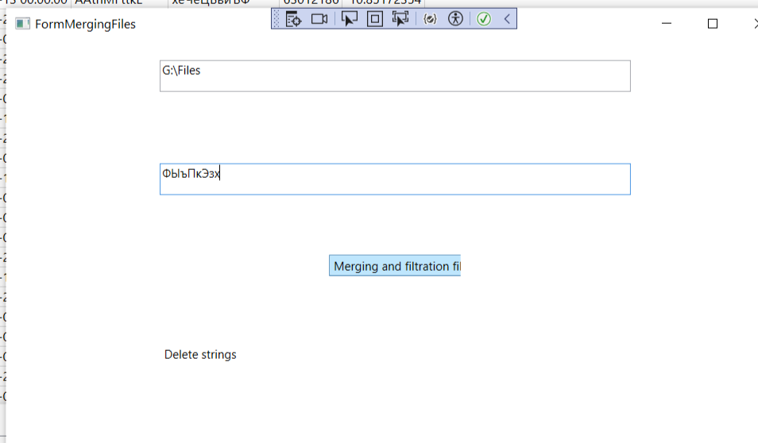

# Задание 1
## использовался Sqlite
- Окно при старте. 

- При нажатии на кнопку Import to database появляется окно. В этом нажимаем на кнопку Generate files. Папка, куда будут генерироваться файлы указана в коде.

- Результат генерации файлов.

- Пример содержимого файла.

- В окне так же есть кнопка Import to database. Нужно указать папку, откуда ходим импортировать файлы.

- Процесс загрузки в базу данных отображается в окне.

- Данные в базе данных 

- Структура таблицы

- Сумма целых и медиана дробных

- На главном окне есть кнопка для слияния файлов и удаления по введенному тексту(второе поле для ввода для введения фильтра для удаления)

- При удалении появляется окно с информацией об удаленной строке

- После удаления окно об успешном завершении

- Результат объединения файлов - новый файл
